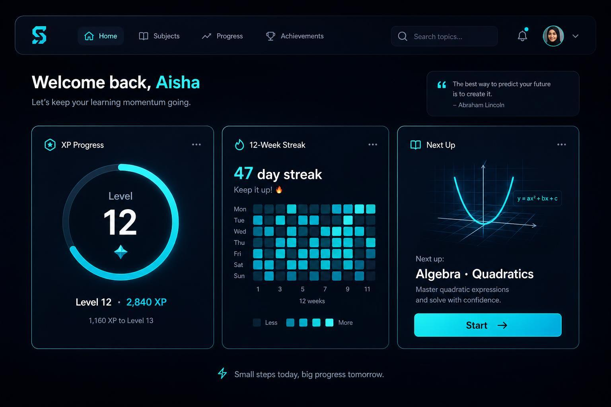

# Development Report

This is a running log of what's been built, explained in plain language.
Newest entries are at the top. See `docs/RULES.md` for the format Claude
Code follows when adding to this file.

---

## 2026-08-31 — The weekly progress view

**What was built:**
A new Progress page, reachable from the top navigation, which until now said
"soon". It answers one question: what actually got done this week. It shows the
week's total, which days of the week you were active, a per-track breakdown
with each track's streak, and a list of the last eight weeks. Weeks run Monday
to Sunday, the same as the grid on the other screens.

**How it works (flow):**
1. The page reads the daily completion records — the same ones the terrain and
   the streak already use. Nothing new is stored.
2. A new piece of code sorts those days into weeks. It works out, for each
   week, how many tasks were finished and on how many separate days.
3. Two numbers per week rather than one, on purpose: four tasks in one sitting
   and four tasks across four days are not the same week, and only the second
   number tells them apart.
4. The current week counts only the days that have actually happened. On a
   Monday it says "1 of 1 day", not "1 of 7".
5. A week with nothing in it is shown as a real, empty week — it is not
   skipped, and nothing is drawn to fill the space.

**A deliberate restraint:**
The first version had a small bar for each week beside the heading. It was
removed for two reasons. The project's design rules say the visuals should be
real drawings rather than bar charts; and a row of weekly bars is really a
trend line, which is the *next* piece of work and one whose form has
deliberately not been decided yet. Building it here by accident would have
settled that question without meaning to. What is there instead is the current
week shown as seven day squares, in the same visual language as the existing
twelve-week grid.

**What was checked:**
- 21 tests of the week maths on its own: Monday and Sunday boundaries, the
  midnight between them, weeks that straddle a month, empty weeks kept in
  sequence, gaps preserved, several tracks active on the same day counting as
  one day, and a year of weeks bucketing without drift
- 19 browser checks: contrast at or above 4.5:1 on all four backgrounds in
  both themes, keyboard reachable with a visible focus ring, the day strip
  carrying a text description, no sideways scrolling at 390, 768 or 1280
- The rendered figures were cross-checked against the database independently,
  using SQL rather than the app's own code, on data containing gaps, empty
  weeks, three tracks and a Sunday completion. Every week matched
- The completion and streak tests from earlier work were re-run and still pass
- Typecheck, lint and a production build pass; the console is clean; the test
  data was removed afterwards

**Technical concepts used:**
- A reusable "period" layer — the same code will produce monthly summaries by
  handing it months instead of weeks, so the monthly view is a small addition
  rather than a second implementation
- Half-open date ranges (start included, end excluded) — the standard way to
  make sure no day is counted twice or dropped at a boundary
- Server-rendered page reading live data on every request, like the others

**Roadmap status:** Phase 2, "Weekly summary view" complete. Two other Phase 2
items were found to be already built and are now ticked. Monthly, milestone
celebration and trajectory remain.

---

## 2026-08-30 — The survey redesign, and a quiet daily atmosphere

**What was built:**
Rendred no longer looks like a dashboard. It looks like a survey sheet: your
terrain runs edge to edge across the top of the page as the ground everything
else stands on, sections are separated by thin ruled lines instead of rounded
boxes, and the numbers are set in a typewriter-style face so they read as
measurements. There is also a new, deliberately quiet touch — the faint pattern
and tint behind the page changes with the day of the week, drawn from your own
interests. It is never labelled and never named; you will know why Wednesday
looks different, and nobody else needs to.

**How it works (flow):**
1. The page is rendered on the server, which checks what day it is locally and
   picks one of four background "atmospheres" — three that rotate across
   weekdays, one for the weekend.
2. That choice sets a handful of background-only colour variables. They paint
   a faint tint, a ruled grid and one piece of geometry behind everything.
3. The rest of the page uses a completely separate set of colours — the ones
   that carry meaning. Purple is progress, amber is your streak, green is
   completion.
4. Because the two sets never mix, changing the day can never change what a
   colour means. The terrain, the ring and the tick look identical on every
   day of the week. This was checked, not assumed.

**What changed visually:**
- **Typography.** Three faces instead of one: a serif for track names, a
  monospace for every number and label, and the existing sans for body text
  and tasks. Hierarchy now comes from which face is used, at what size, in
  what case — not from making things bold.
- **No more cards.** Rounded corners now mean one thing only: you can click it.
  Buttons, inputs and the completion tick are rounded; panels and sections are
  not. They are separated by a hairline and by space.
- **Full-bleed terrain.** It runs off the right edge of the page, with
  milestone values printed in the left margin at the exact height they were
  crossed, like contour lines on a map.
- **Less motion.** Animations that reported nothing were removed: cards sliding
  in, cards lifting on hover, the heatmap fading in cell by cell, and a dot that
  appeared a second after load. What survives is the moment a task is completed
  and the drawing of the data itself.

**What did NOT change:**
Nothing about how the app actually works. The completion engine, the streak
rules, the database and every server action are untouched. The full Item 6 test
suite was re-run against the redesign and still passes.

**What was checked:**
- Typecheck, lint and a production build all pass
- The Item 6 engine suites re-run in full: 15 + 21 + 3 checks, all passing,
  including three browser tabs completing at the same moment
- 21 redesign checks: the completion tick still reachable by keyboard with a
  visible focus ring and a 32px target, contrast at or above 4.5:1 on all four
  atmospheres in both themes, nothing animating under reduced motion, and no
  sideways scrolling at 390px or 768px
- Screenshots reviewed in both themes, desktop and phone. Four problems were
  found this way and fixed: the terrain over-extending past the window, the
  atmosphere being far too strong at full page size, the scale labels colliding
  with the landform, and a panel label drifting to the bottom of the page
- The browser console is clean, the database passes its integrity sweep, and
  the test data was removed afterwards

**Technical concepts used:**
- `next/font/google` — loads the two new typefaces with the app, no new package
- CSS custom properties in two separate layers — one for meaning, one for
  atmosphere, so the second cannot leak into the first
- Container-relative full-bleed maths — lets the terrain escape the page
  column without over-shooting the window
- A pure server-side function for the day-to-atmosphere choice, so the server
  and the browser can never disagree about it

**Roadmap status:** no roadmap item. This is the visual direction approved on
2026-08-30 and recorded in `CLAUDE.md` and `docs/DECISIONS.md`.

---

## 2026-08-30 — Marking tasks complete, and the streak engine behind it

**What was built:**
Every task now has a tick box. Click it and the task is done: the ring on the
right advances, the elevation number rises, the streak counts up, and today
lights up on the twelve-week grid. Click it again and it goes back to pending.
This is the piece that makes the rest of the app mean anything — until now
nothing in the app ever wrote a day of activity, so every chart sat at zero for
a real user.

**How it works (flow):**
1. You click the tick on a task → the tick fills in straight away, before the
   server has answered, so the click feels immediate.
2. The server marks that one task as done and stamps the time on it.
3. It then rebuilds *today's* daily record for that track by counting the
   tasks whose completion time falls in today — it does not add one to a
   running total. Counting again from scratch is what makes a double-click,
   a retry, or a complete-undo-complete round trip harmless: the answer is
   always the same.
4. It recalculates the streak by walking back through the daily records: how
   many days in a row end at today (or yesterday, since today is not over),
   and what the longest such run has ever been.
5. Steps 2 to 4 happen in a single transaction — a unit of work the database
   either applies completely or not at all — so history can never end up
   disagreeing with the tasks it came from.
6. The page re-reads from the database, and the ring, elevation, streak and
   grid all update together.

**The rules it follows:**
- **Strict streaks, no forgiveness.** Miss a day and the count goes to zero.
  There are no freezes and no grace periods, and the code has no place to add
  one. Today does not count as missed until it is over, so a streak whose last
  activity was yesterday is still alive.
- **Streaks are per track.** Practising Spanish does not protect a DSA streak.
- **History is written once.** Only today's record can change. A day you
  already earned stays earned, even if you later delete or un-tick the task
  that earned it.
- **The "3 of 8 done" figure always reads the tasks themselves**, so it drops
  the instant you un-tick something, while the history behind the terrain does
  not rewrite itself.
- **A lapsed streak shows as lapsed without you having to do anything.**
  Stopping for a week does not send anything to the server, so there is nothing
  to trigger a reset; the streak is therefore worked out fresh each time the
  page is read.
- **Days are your local days.** Everything used to roll over at 5:30am India
  time, which could break a streak unfairly. All day boundaries now come from
  one shared piece of code.

**What was checked:**
- 13 tests of the streak rules on their own: a missed day resets, a gap breaks
  the run, the longest run survives a lapse, month boundaries and a run longer
  than the twelve-week chart all count correctly
- 36 checks driven through a real browser against the production build:
  completing, un-completing, three completions in one day sharing one record,
  complete-undo-complete not double counting, three rapid clicks on one task,
  three browser tabs completing at the same moment, two tracks not affecting
  each other, deleting a task completed today, un-completing a task finished
  days ago, and the home screen totals
- Keyboard only: the tick is reachable by Tab, shows a focus ring, and toggles
  with both Space and Enter
- Reduced motion: nothing is left animating, and the tick is fully drawn
  rather than frozen mid-animation
- Both themes, and a 390px phone width with no sideways scrolling
- The browser console is clean, and the database passes an integrity sweep:
  no duplicate day records, every date stored at local midnight, no completed
  task missing its timestamp, no orphaned rows
- Typecheck, lint and a production build all pass. Test data was removed
  afterwards

**Technical concepts used:**
- Prisma transaction (a group of database writes that all succeed or all fail
  together) — keeps the task, the daily record and the streak in step
- Upsert (update the row if it exists, otherwise create it) — one daily record
  per track per day, enforced by the database itself
- React `useOptimistic` — shows the tick immediately and quietly corrects
  itself if the server disagrees
- `aria-pressed` on a toggle button — tells a screen reader whether the task
  is done, without changing what the button is called

**Roadmap status:** Phase 1, "Mark Task complete → updates CompletionLog +
streak logic" and "Strict streak logic (reset on missed day)" are complete.
The remaining Phase 1 item is the basic-UI checkbox, whose last missing piece
(the mark-complete surface) landed here.

---

## 2026-08-30 — Create, rename and delete Tracks

**What was built:**
You can now actually use the app. Type a name, press Add, and a Track appears
in the list. Each track can be renamed in place, or deleted — and deleting
asks first, spelling out exactly what else will disappear with it. The counts
in the Status panel update as you go.

**How it works (flow):**
1. You type a name and press Add → the browser sends it straight to the
   server, with no page reload.
2. The server checks the name is not blank and not too long. If it is, the
   form shows a short message and nothing is saved.
3. If the name is fine, a new Track row is written to the database.
4. The page is told its data is stale, so it re-reads from the database and
   the new track appears in the list with the counts updated.
5. Rename works the same way. Delete first swaps the row into a confirmation
   that names what will be removed, and only deletes once you confirm.

**Why delete asks first:**
Deleting a Track also deletes every Topic, Task and daily record underneath
it — that is built into the database and cannot be undone. So the
confirmation names them: "Delete DSA and its 2 topics and 2 tasks?" If a
track is empty, it just asks about the track.

**What was checked:**
- Adding a blank name is refused, and no track is created
- Two tracks created, renamed, and one deleted — the list and the counts
  tracked each change correctly
- Renaming to a blank name is refused and leaves the original name alone
- Cancelling a delete leaves everything untouched
- The cursor does not get grabbed by the name box when the page loads, but
  does return to it after adding, so several tracks can be typed in a row
- Checked in both light and dark themes; no errors in the browser console

**Technical concepts used:**
- Server Actions — the form talks directly to the server without a separate
  API layer, so validation and saving happen in one place
- Cascade delete (already in the database) — removing a Track cleans up
  everything belonging to it automatically
- Revalidation — after a change, the page is marked stale so it re-reads
  fresh data instead of showing a cached copy
- Playwright click-through test — a script that actually types, clicks and
  confirms, rather than only reading the code

**Roadmap status:** Phase 1, item 3 ("CRUD: create/edit/delete Track") —
marked [x] complete in `docs/ROADMAP.md`. Test data created during checking
was deleted afterwards, so the database is empty.

---

## 2026-08-29 — Redesigned to the dashboard reference (light + dark themes)

**What was built:**
The whole look of the app changed. The earlier "trail map" style — dark green
background with contour lines — is gone, replaced by the clean card-based
dashboard from the reference images you sent. It now comes in two themes:
blue-on-white for light, purple-on-black for dark, with a button in the corner
to switch between them. Your choice is remembered.

**How it works (flow):**
1. All the colours are defined once as named slots — "page background",
   "card", "main text", "accent" — rather than written into each screen.
2. Picking a theme swaps what colour each named slot points at. Every screen
   updates automatically, because no screen knows an actual colour.
3. A tiny script runs before the page is drawn, checks what you chose last
   time, and applies it immediately — so you never see a flash of the wrong
   theme while the page loads.
4. If you have never chosen, it follows your computer's own light/dark setting.
5. The home page reads live counts of tracks, topics and tasks straight from
   the database — the first time the app has actually talked to the database.

**Two problems found by looking at it:**
- **Words ran together.** The new font, Plus Jakarta Sans, has an unusually
  narrow space character — measured at about two-thirds the width of a normal
  font's space. "SQLite via Prisma 7" read as "SQLite viaPrisma 7". Widened
  the gap slightly to fix it.
- **Colours failed readability.** The first colour set was checked before any
  screen was built, and eight combinations were too faint to read against
  their background. They were corrected before writing any UI, rather than
  after.

**Technical concepts used:**
- Design tokens — colours stored as named slots instead of fixed values, so
  one switch restyles the whole app
- Theme persistence — the choice is saved in the browser so it survives
  closing the tab
- Contrast checking — every text/background pair measured against the 4.5:1
  readability standard, in both themes, before building
- Playwright screenshots in both themes, plus a click-test proving the toggle
  overrides the system setting and survives a page reload

**Roadmap status:** no roadmap item changed. This was a change of visual
direction, not a Phase 1 feature. Phase 1 item 3 (create/edit/delete Track)
is still the next thing to build. `CLAUDE.md` was rewritten so its design
section matches what was actually built.

---

## 2026-08-29 — Database tables created (Track, Topic, Task, CompletionLog)

**What was built:**
The app now has real database tables. It can store learning goals ("Tracks"),
the topics inside them, the individual tasks inside those, and a per-day tally
of how many tasks were finished. Nothing in the app writes to these yet — the
buttons and screens come next — but the structure they will write into exists
and has been tested.

**How it works (flow):**
1. The tables are described in one file, `prisma/schema.prisma`, in plain
   readable terms rather than database code.
2. Running a migration (a recorded, repeatable change to the database
   structure) turned that description into actual tables in `prisma/dev.db`,
   a single file on your machine.
3. The migration is saved in `prisma/migrations/` so the exact same structure
   can be rebuilt from scratch later.
4. A throwaway test then created a track with a topic and a task, checked the
   safety rules held, and deleted it again — leaving the database empty.

**What the test confirmed:**
- A new Track correctly starts at streak 0 with no recorded activity
- A new Task correctly starts as "pending"
- The database **refuses** a second daily tally for the same track on the same
  day — this is what keeps streak counting honest
- Deleting a Track automatically removes its topics, tasks and daily tallies,
  so nothing is left orphaned

**Technical concepts used:**
- Migration — a saved, replayable instruction for changing the database
  structure, so the database can always be rebuilt to match the code
- Unique constraint — a database-level rule that blocks duplicate rows; used
  here to guarantee one tally per track per day
- Cascade delete — when a Track is deleted, everything belonging to it is
  deleted too, automatically
- Indexes — lookup shortcuts so finding "all topics in this track" or "all
  pending tasks" stays fast as data grows

**Roadmap status:** Phase 1, item 2 ("Prisma schema from docs/SCHEMA.md") —
marked [x] complete in `docs/ROADMAP.md`. `docs/SCHEMA.md` was updated to
record the constraints and defaults added while building it.

---

## 2026-08-29 — Visual QA pass on the scaffold (typography fix)

**What was built:**
Checked the scaffold screen in a real browser instead of trusting that the
code was right — and found the fonts were not working at all. Every heading,
label and number was falling back to the plain system font, so none of the
project's chosen typefaces were showing. Fixed that, made the faint background
lines actually look like a contour map, and lightened the muted grey so
secondary text is readable.

**How it works (flow):**
1. Started the app, opened it in an automated browser, took screenshots at
   desktop and phone widths.
2. Compared the screenshots against the "Visual Design Direction" in
   CLAUDE.md → spotted that the headline was not a serif and the numbers were
   not monospaced.
3. Asked the browser what fonts it had actually loaded → it reported none,
   confirming the styling tool had silently discarded all three font settings.
4. Fixed the cause, re-took the screenshots, and confirmed all three typefaces
   now load and apply.

**What was wrong, in plain words:**
- **Fonts:** Tailwind (the styling tool) has two ways to declare a setting.
  One of them quietly fails if the setting points at another setting — which
  is exactly what font settings do here. All three fonts were declared the
  wrong way, so they were thrown away without any error message. Only looking
  at the page revealed it.
- **Contour lines:** they were evenly spaced wavy lines that read as generic
  decoration. Replaced with real nested elevation rings around two summits,
  spaced tight-then-wide the way a real map shows steep ground flattening out.
- **Readability:** the muted grey from the design brief measured 2.86:1
  against the dark background — below the accessibility minimum of 4.5:1 — so
  the tagline and labels were genuinely hard to read. Lightened to 5.84:1.

**Technical concepts used:**
- Playwright (software that drives a real browser automatically) — used to
  load the page and capture screenshots without a human clicking
- Contrast ratio check — a standard measure of whether text is legible
  against its background; anything under 4.5:1 fails for normal text
- Screenshot comparison at 500 milliseconds — proved the contour animation
  genuinely draws in over time, and that turning on the system's
  "reduce motion" setting skips it and shows the finished state instantly

**Roadmap status:** still Phase 1, item 1 — this was a correction to work
already marked complete, not a new item. No roadmap checkbox changed.

---

## 2026-08-29 — Project scaffold (Next.js + Tailwind + Prisma + SQLite)

**What was built:**
The empty shell of the app now exists and runs. There is a working web page
with the project's own visual style — dark ink background, warm off-white
text, and faint contour lines like a topographic map — plus a database
connection wired up and ready for real data. Nothing can be tracked yet; this
is the foundation everything else sits on.

**How it works (flow):**
1. You run `npm run dev` → Next.js (the web framework) starts a local server
   at `http://localhost:3000`.
2. Next.js loads the root layout, which pulls in three typefaces — a serif for
   headings, a plain sans for reading, and a monospace one reserved for
   numbers and dates so they read like data.
3. The page draws the contour-line background, which traces itself in once on
   load, then stops. If your system is set to reduce motion, it skips the
   animation entirely.
4. Separately, the app can now open a SQLite database — a single file on disk
   at `prisma/dev.db` — through a shared connection kept in `lib/prisma.ts`.
   Nothing reads or writes to it yet, because no tables are defined until the
   next step.

**Technical concepts used:**
- Next.js 15 with the App Router (the web framework that turns files into
  pages) — pinned to version 15 because it works properly on your Node 26
- Tailwind CSS v4 (a styling tool where colours and fonts are defined once as
  named tokens) — used to define the trail palette so no screen has to
  hand-pick colours
- Prisma 7 (a tool that lets code talk to the database without writing raw
  SQL) — set up pointing at SQLite, with tables still to come
- Driver adapter (`@prisma/adapter-better-sqlite3`) — Prisma 7 no longer talks
  to SQLite directly, it needs this small piece in between
- Shared database connection in `lib/prisma.ts` — stops the app opening a new
  connection every time you save a file during development
- SVG `pathLength` — normalises every contour line to the same length so one
  animation setting draws them all correctly

**Roadmap status:** Phase 1, item 1 ("Project scaffold: Next.js + TypeScript +
Tailwind + Prisma + SQLite") — marked [x] complete in `docs/ROADMAP.md`. The
Prisma schema itself (item 2) is deliberately still empty.

---
